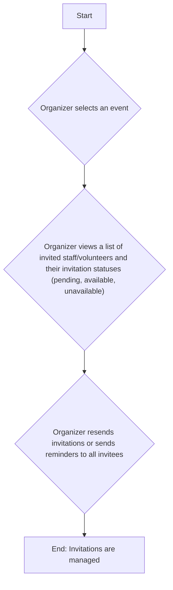
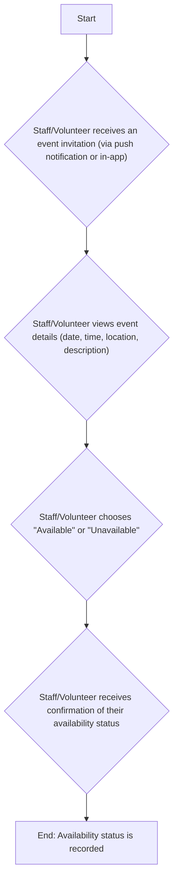
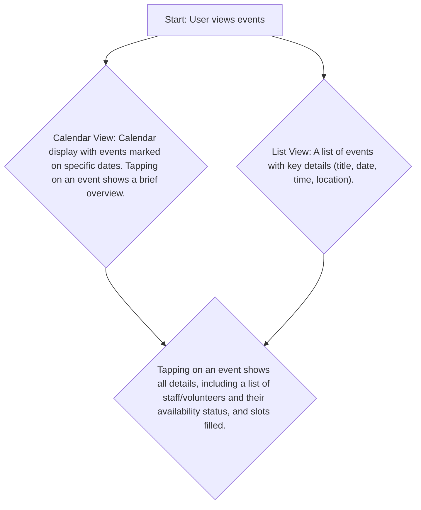

## Teven Scheduling App Requirements

**1. Introduction**

* 1.1. Purpose

  * To outline the requirements for the development of Teven, a service and mobile application that facilitate event scheduling and management.

* 1.2. Scope

  * Teven will allow users to create events, invite staff, track staff availability, and manage event details.

* 1.3. Goals

  * To provide a user-friendly and efficient way to schedule and coordinate events.

  * To streamline the event planning process and reduce the time and effort required.

  * To improve communication and organization among event organizers and staff.

**2. Target Audience**

* 2.1. User Personas

  * **Event Organizer Persona:**

    * Name: Sarah

    * Demographics: busy professional or active social organizer

    * Tech Savviness: Comfortable with mobile apps, uses calendars and social media

    * Needs:

      * Easy way to schedule events.

      * Ability to invite staff.

        * open invitations to any

        * sign up specific members

      * Clear overview of staff availability.

      * Tools to manage event details.

      * Option to send reminders.

      * Ability to select from prior customers.

      * Ability to view/manage all customers.

      * Ability to delegate event management tasks to other users (e.g., event creation, customer management, inventory management, reporting).

    * Pain Points:

      * Difficulty coordinating schedules.

      * Losing track of RSVPs.

      * Time-consuming event planning.

      * Needing to re-enter customer details.

      * Overwhelmed by managing all aspects of event planning.

  * **Staff Persona:**

    * Name: David

    * Demographics: colleague of the organizer

    * Tech Savviness: Uses mobile apps for communication and scheduling

    * Needs:

      * Clear event invitations.

      * Simple way to RSVP.

      * Option to view event details.

      * Reminders about upcoming events.

      * Clear understanding of assigned roles and responsibilities.

        * Ability to view assigned hours

        * Ability to view event inventory

    * Pain Points:

      * Missing event invitations.

      * Forgetting to RSVP.

      * Difficulty keeping track of multiple events.

      * Unclear responsibilities and lack of empowerment.

* 2.2. User Needs

  * **Event Organizers** need a tool to efficiently create and manage events, invite staff, track staff availability, and manage customer data, with the ability to delegate tasks to other users and track inventory and generate reports.

  * **Staff** need a simple way to receive event invitations, indicate their availability, view event details, understand their assigned roles, view their assigned hours, and view event inventory.

**3. Product Features**

* 3.1. Core Features

  * Event Creation:

    * Allow users to create new events with details like:

      * Event title

      * Date and time

      * Location

      * Description

        * Inventory: A list of items needed for the event, selectable from a master inventory list.

      * Customer: Associate the event with one customer from the organizer's managed customer list.

      * Staff Invites: Organizers can either **select specific staff members from the available pool** or **make the invitation open and unspecified, allowing staff to opt-in**, and specify the number of staff needed for the event.

    * Allow users with the appropriate role to create events.

    * Inventory Management

      * Allow users with the appropriate role to view and modify the inventory list

  * Invitation Management:

    * Send invitations to selected contacts

    * Track staff RSVP status

    * Resend invitations or send reminders

  * Availability Functionality:

    * Enable invitees to easily indicate their availability for events

    * Provide options to accept or decline

    * Allow invitees to view select event details

  * Event Viewing:

    * Display events in a clear and organized format.

    * Organizers can view full event details, including attendees, staff assigned, and inventory.

    * Staff can view essential event details: name of event, address, and date/time only.

  * User profiles

    * Users can **be invited to create** and manage their profiles

    * Settings for notifications and preferences

      * Staff details (e.g., contact information, roles, hours worked, skills, **phone number, date of birth**, **display name**)

  * Customer Management:

    * Allow organizers to view a list of all customers.

    * Allow organizers to add new customers.

    * Allow organizers to edit customer details.

    * Allow users with the appropriate role to manage customer data.

  * Role-Based Access Control (RBAC):

    * Define roles with specific permissions (e.g., Event Creator, Customer Manager, Inventory Manager, Reporter).

    * Allow organizers to assign roles to other users.

    * Control access to features based on user roles.

  * Organization Management (SuperAdmin Only):

    * Allow SuperAdmins to list all organizations.

    * Allow SuperAdmins to create new organizations.

    * Allow SuperAdmins to edit existing organizations.

    * Allow SuperAdmins to delete organizations.

  * Reporting

    * Allow users with the appropriate role to generate reports, such as:

      * Staff hours worked within a given time frame.

      * Inventory usage frequency.

* 3.2. Secondary Features

  * Recurring Events: Support for creating events that repeat (daily, weekly, monthly).

  * Calendar Integration: Integration with other calendar apps (Google Calendar, Apple Calendar).

  * Notifications:

    * Push notifications for new invitations, reminders, and event updates.

    * In-app notifications

  * Location Services: Use GPS to suggest locations or provide directions.

  * Customizable Invitations: Options to personalize invitations with themes or messages.

**3.3. Key Feature Workflows (Visuals)**

Here are simplified diagrams illustrating the app flow for the core features:

### Event Creation

```mermaid
graph TD
    A[Start] --> B{Organizer navigates to Create Event};
    B --> C{Organizer enters event title, date, time, location, and description};
    C --> D{Organizer selects staff/volunteers from a list/pool and specifies the number of slots for each};
    D --> E{Organizer saves the event as a draft or publishes it to send invitations};
    E --> F[End: Event is created, and invitations are sent (if published)];
```

### Invitation Management



### Availability Functionality (Staff/Volunteer)



### Event Viewing



**4. Functional Requirements**

* (Further detail will be added here, but includes)

  * User authentication and authorization

  * **Invitation-based user registration flow.**

  * Event data storage and retrieval, including inventory data.

  * Invitation sending and RSVP tracking

  * Calendar display and event listing with role-based visibility.

  * Notification management

  * User profile management, including staff details.

  * Role management (create, edit, delete roles).

  * User role assignment and management.

  * Access control implementation based on roles.

  * Inventory management (view, add, edit inventory items, track item usage).

  * Reporting (generate staff hour reports, inventory usage reports).

**5. Non-Functional Requirements**

* (Further detail will be added here, but includes)

  * Usability: Teven should be intuitive and easy to use for both organizers and staff.

  * Performance: Teven should be responsive and load quickly.

  * Scalability: Teven should be able to handle a growing number of users, events, and inventory items.

  * Reliability: Teven needs to reliably send invitations, track RSVPs, and manage inventory data.

  * Security: Implement robust security measures to protect user data and control access to sensitive features based on roles, including inventory data and reports.

  * Compatibility: (To be expanded)

  * Accessibility: (To to be expanded)

**6. Technical Requirements**

* (To be added)

**7. Design Requirements**

* (To be added)

**8. Testing and Quality Assurance**

* (To be added)

**9. Deployment**

* (To be added)

**10. Maintenance and Support**

* (To be added)

**11. Constraints**

* (To be added)

**12. Assumptions**

* (To be added)

**13. Approval**

* (To be added)
