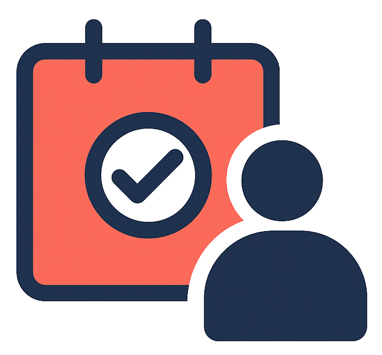

# **Teven \- Event Scheduling and Management Application**



## **Project Overview**

Teven is a comprehensive event scheduling and management application designed to streamline the process of organizing events, managing staff, and tracking essential resources. It aims to provide a user-friendly platform for event organizers to efficiently create events, invite and manage staff, handle customer data, and gain insights through reporting. Staff members, in turn, can easily view their assigned events, indicate their availability, and understand their roles.

## **Documentation**

This repository contains the core documentation for the Teven project. As the project evolves, more detailed specifications and guides will be added here.

* Product Requirements Document (PRD):  
  This document outlines the high-level requirements, features, user personas, and functional/non-functional specifications for Teven. It serves as the single source of truth for what Teven aims to achieve.  
  See [the PRD](PRD.md) for details
* Backend Engineering Design Specifications:  
  This document details the proposed backend architecture for Teven, including technology choices (Ktor, Exposed, Kotlin Coroutines), modular structure, and API design principles.  
  See [the backend Eng Design](BACKEND-DESIGN.md) and [API specification](API.md) for more.
* Flutter Conversion Plan:  
  The React frontend in `frontend/` is being rewritten in Flutter, web-first. The plan tracks every task, the parity matrix against the React source, and decisions made along the way.  
  See [FLUTTER-CONVERT.md](FLUTTER-CONVERT.md) for progress and [the Flutter app README](flutter_app/README.md) for development setup.
* **Future Documents:**  
  * Frontend Design Specifications  
  * Database Schema  
  * Deployment Guide  
  * Testing Strategy  

## **Getting Started**

To get started with the Teven application, you can use Docker Compose to set up and run the backend and database services.

### Prerequisites

* Docker Desktop (or Docker Engine and Docker Compose plugin) installed.

### Running with Docker Compose

The project is configured to run out-of-the-box using default environment variables. For customization, you can create a `.env` file in the project root to override the defaults.

1.  **Set up your environment variables (optional).**

    Create a `.env` file in the root directory by copying the example file:

    ```bash
    cp .env.example .env
    ```

    Modify the `.env` file with your desired database credentials. Any variables set in this file will override the default values in `docker-compose.yml`.

2.  **Build and start the services.**

    Navigate to the root directory of the project and run:

    ```bash
    docker compose up --build -d
    ```

    This command will build and start the services in detached mode, meaning it will run in the background.

3.  Once the services are up and running, the backend API will be accessible at `http://localhost:2022` (or your custom port if you set one).

### Stopping the Services

To stop the running Docker containers, run:

```bash
docker compose down
```

To stop and remove the containers, networks, and volumes (for a clean slate), use:

```bash
docker compose down -v
```

### Database Configuration

The database connection details are configured via environment variables in the `.env` file. See `.env.example` for a list of all required variables.

Here's a breakdown of the variables:

*   `TEVEN_POSTGRES_DB`: The name of the database for the backend application to use.
*   `TEVEN_POSTGRES_USER`: The username for the database user.
*   `TEVEN_POSTGRES_PASSWORD`: The password for the database user.
*   `TEVEN_BACKEND_PORT`: The external port on your machine that maps to the backend container's port.

### Test Data

To populate the database with test data, you can set the `DEV_MODE` environment variable to `true` in your `.env` file.

```
DEV_MODE=true
```

When this variable is set, the application will be populated with a set of test data on startup, including organizations, users, customers, inventory items, and events. This is useful for development and testing purposes.

## **Frontend**

The frontend is in the middle of a rewrite. Two implementations currently exist in this repository:

| Location | Stack | Status |
|---|---|---|
| `frontend/` | React 19, Vite, TypeScript, Bootstrap | **Live.** Served by the backend, unmodified |
| `flutter_app/` | Flutter (Dart), Riverpod, go_router | In progress — scaffold only so far |

The React app remains the production frontend until the conversion reaches cutover. It is not to be modified or removed during the conversion; see the ground rules in [FLUTTER-CONVERT.md](FLUTTER-CONVERT.md).

### Developing the Flutter app

```bash
cd flutter_app
flutter pub get
flutter run -d chrome
```

Requires the Flutter SDK.

> **Status: early scaffolding.** Running this today shows a placeholder screen, not a working app. The conversion is in progress and this app is not yet wired to the API. To use Teven right now, run the React frontend via Docker as described above.

See [flutter_app/README.md](flutter_app/README.md) for analysis, tests, and code generation commands, and [FLUTTER-CONVERT.md](FLUTTER-CONVERT.md) for the full task list and current progress.

## **Contributing**

*(This section will contain guidelines for contributing to the Teven project.)*

## **License**

*(This section will specify the licensing information for the Teven project.)*
